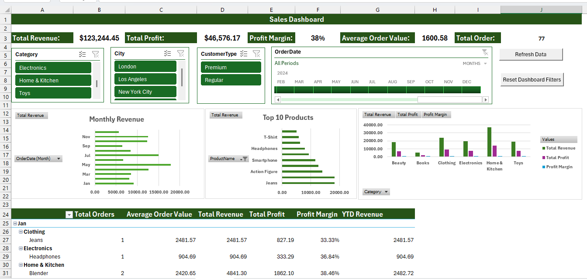

# Advanced Excel Sales Dashboard

An interactive Excel dashboard built using Power Query, Power Pivot, DAX, PivotTables, PivotCharts, slicers, and VBA.

## Dashboard Preview

## Features

- Automated data cleaning with Power Query
- Data modeling with Power Pivot
- DAX measures for KPI calculations
- Interactive PivotCharts and slicers
- Sales and profitability analysis
- VBA automation for dashboard controls

## Tools Used

- Microsoft Excel
- Power Query
- Power Pivot
- DAX
- PivotTables
- PivotCharts
- Slicers
- KPI
- VBA

## Project File

Download the `Advanced_Excel_Sales_Dashboard.xlsm` file to explore the interactive dashboard.

## Author

Shamima
